# 项目介绍
计算机毕业设计，影院购票系统，SpringBoot+Vue
包含前后端代码、开TI报告模板、答辩ppt、设计文档（查重30%以下）
- 咨询V：bishe688

# 功能详情：
## 登录注册
系统用户分为两类，管理员和普通用户。管理员通过固定的账号(admin)登录到系统，普通用户通过注册或者管理员添加进入系统。注册信息包括姓名、头像、性别、生日、联系电话、登录账号、登录密码等。

## 管理端功能设计
用户管理：管理用户信息，包括姓名、性别、生日、联系方式、登录账号、登录密码等。
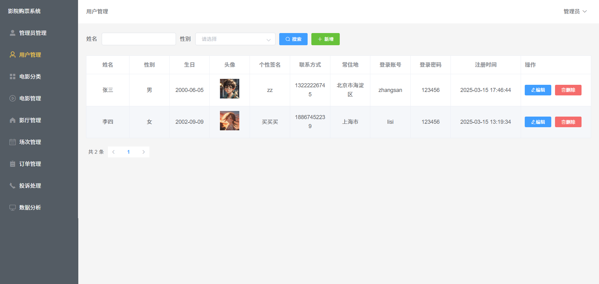
电影分类管理：管理影院上映电影分类，如动作片、喜剧片、科幻片、悬疑片等。
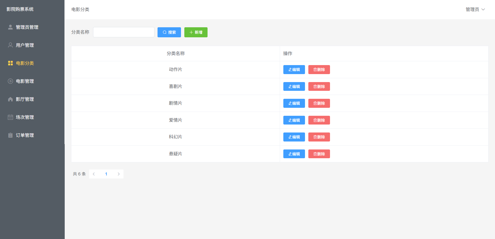
影片管理：管理上映影片信息，包括电影名称、电影类型、电影标签、播放时长、宣传海报、预告片视频、电影简介、演员阵容、导演等信息。
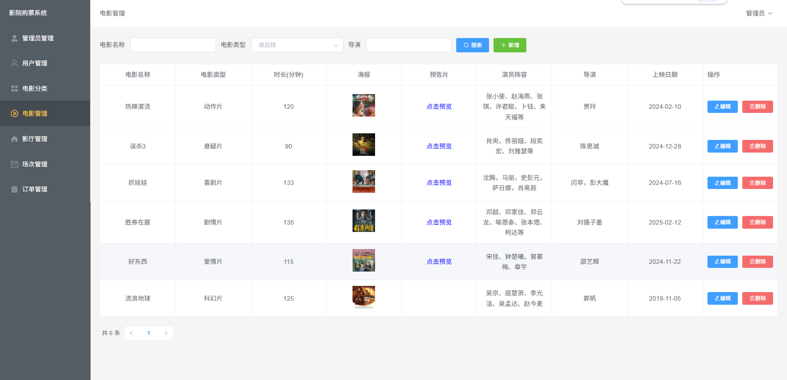
影厅管理：管理影厅信息，包括影厅名称、影厅类别(IMAX影厅、激光影厅等)、总排数、每排座位数。
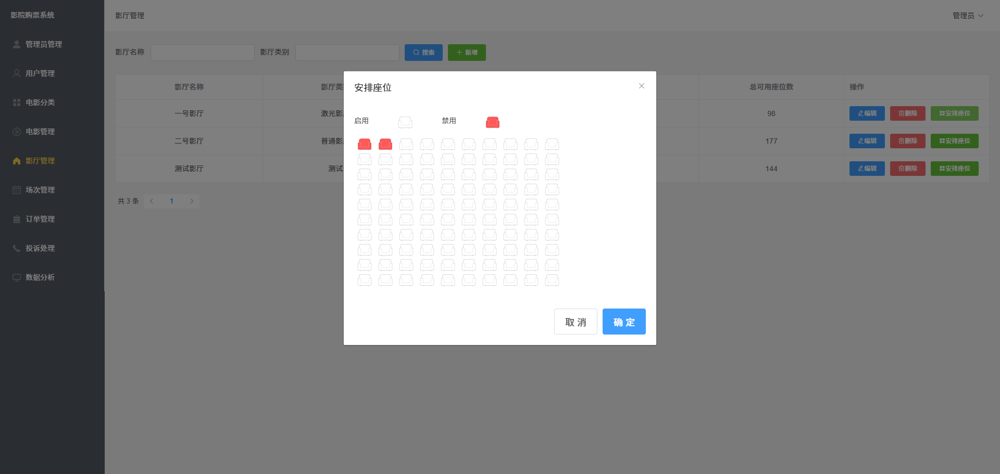
场次管理：管理播放场次信息，包括播放映厅、播放电影、播放日期、播放时间、购票价格。
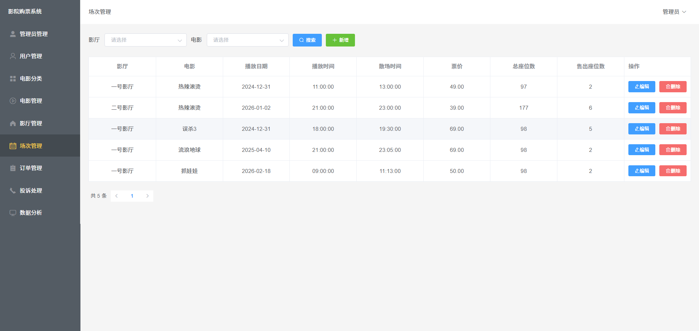
订单信息：查看用户购票订单信息，包括购票用户、购票时间、购票座位、观看电影等。
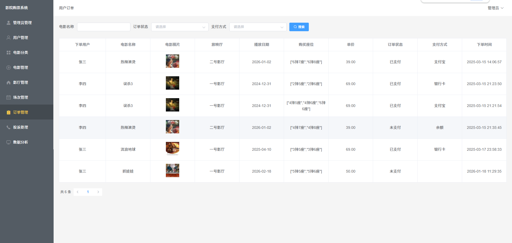

## 用户端功能设计
电影信息：查看平台根据自己的购票记录推荐的电影信息。

电影详情：查看平台上映的电影信息，点击可以查看详情，观看预告片。

在线选座购票：根据电影安排场次信息选择时间和座位进行在线购票。
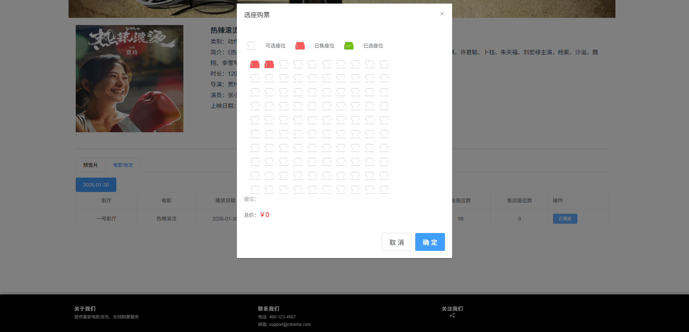
我的订单：查看历史购票信息。
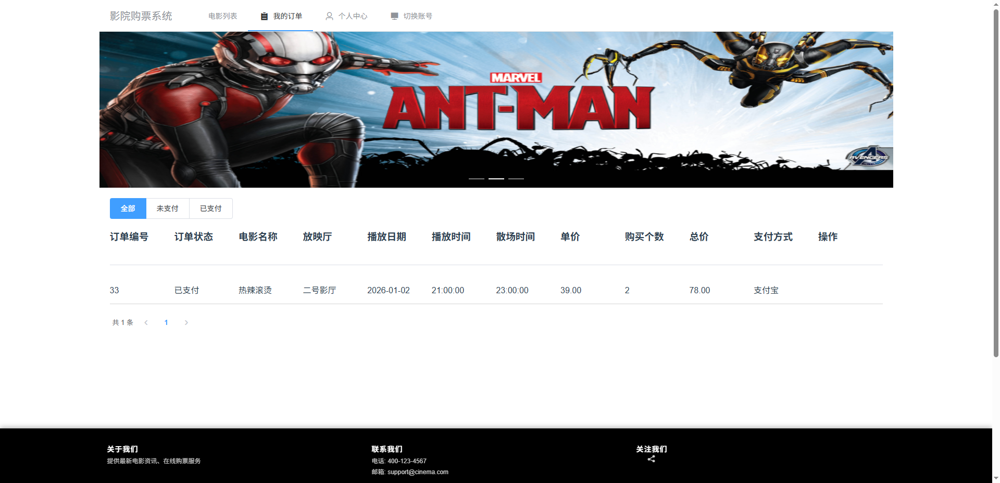
个人中心：查看和修改个人信息，管理投诉记录。
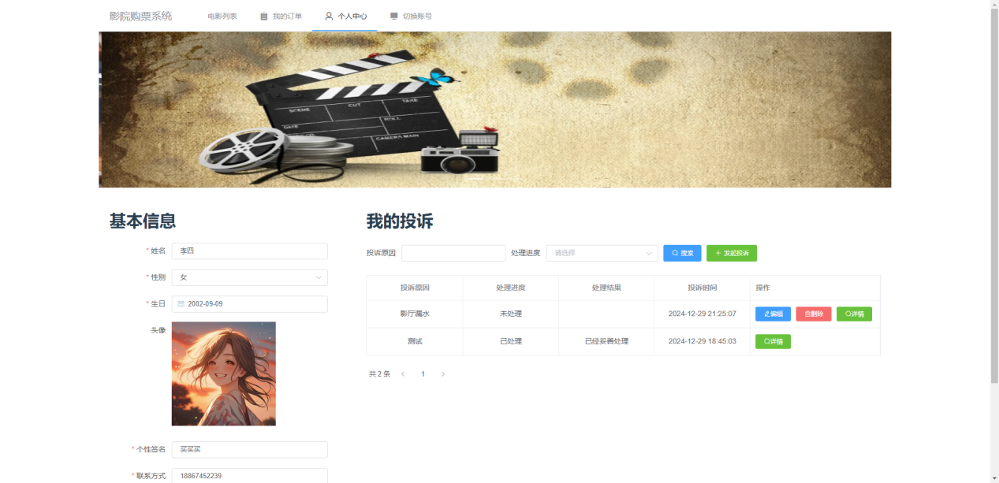

# 材料列表
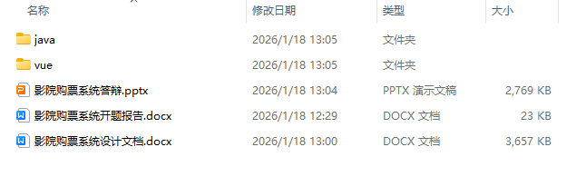

# 万字文档
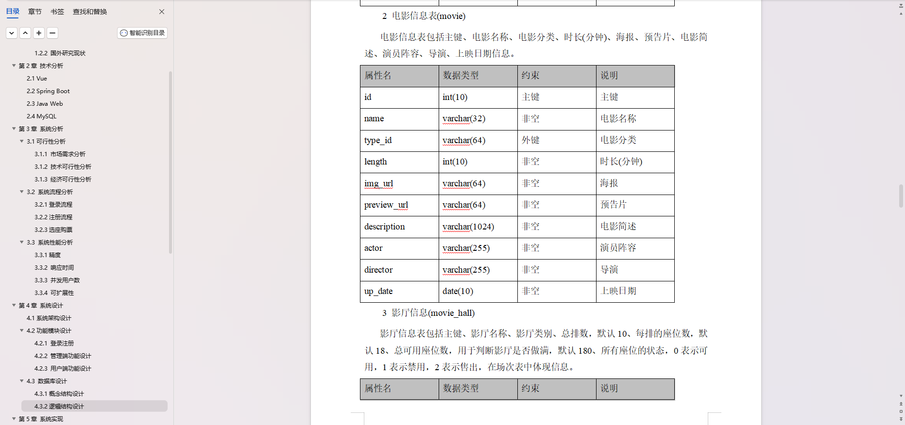

# 需要源码文档请联系
V：bishe688
